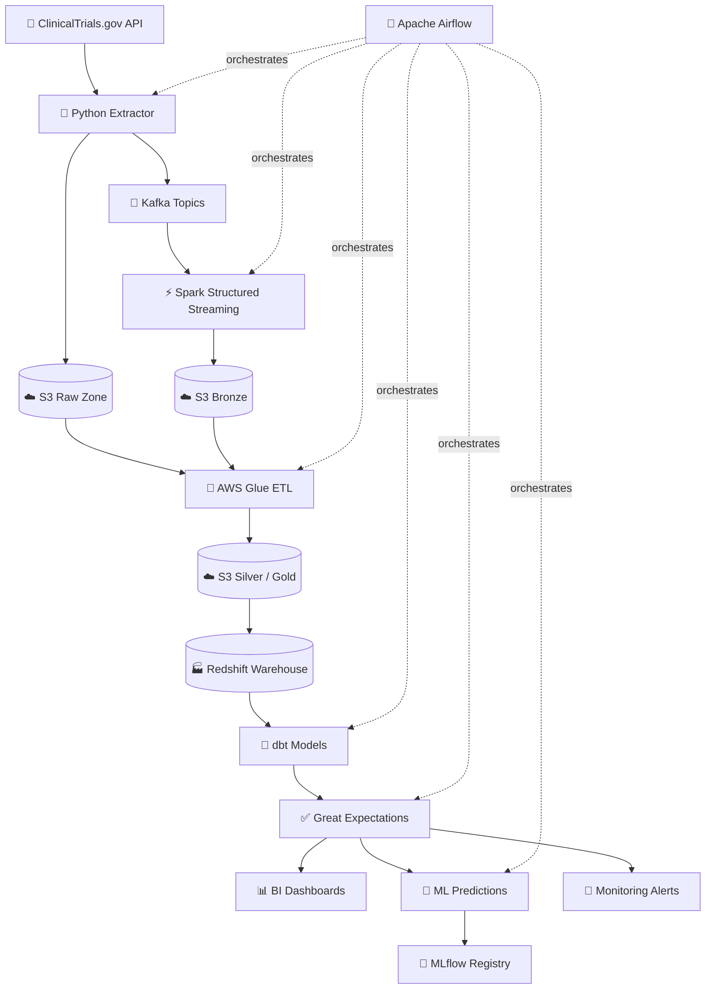

# NIH Clinical Trials Lakehouse Pipeline


---

## Overview

A cloud-native, streaming-capable data engineering pipeline that ingests clinical trial data from the **NIH ClinicalTrials.gov API**, processes it through a **medallion lakehouse architecture** (bronze → silver → gold), enforces data quality with **Great Expectations**, transforms curated data using **dbt**, and drives downstream machine learning and business intelligence — all orchestrated end-to-end by **Apache Airflow**.

This project demonstrates production-grade data engineering patterns including real-time event streaming, declarative data quality, layered data modeling, experiment tracking, and infrastructure-as-code on AWS.

> **Data note:** ClinicalTrials.gov data is publicly available and contains no PII or PHI. All records are aggregated study-level metadata published by NIH.

---

## Architecture



## Business Problem

Clinical trial data is one of the most valuable and complex datasets in healthcare — yet it's notoriously difficult to work with at scale. Sponsors, regulators, and researchers need reliable answers to questions like:

- Which therapeutic areas have the highest trial dropout rates?
- How do enrollment timelines differ across phases and sponsor types?
- Which study designs are most predictive of successful completion?
- Where are geographic gaps in trial recruitment?

This pipeline transforms raw ClinicalTrials.gov API responses into a trusted, analytics-ready lakehouse that powers those answers — with full data lineage, automated quality enforcement, and reproducible ML modeling.

---

## What Makes This Pipeline Production-Grade

| Capability | Implementation |
|---|---|
| Real-time streaming | Kafka topics + Spark Structured Streaming |
| Incremental ingestion | API polling by `lastUpdatePostDate` |
| Layered storage | Medallion architecture (raw → bronze → silver → gold) |
| Declarative transforms | dbt staging + mart models with schema tests |
| Automated data quality | Great Expectations suites + Airflow checkpoints |
| Cloud-native storage | AWS S3 partitioned by date and status |
| Analytical warehouse | Amazon Redshift with optimized distribution keys |
| ML experiment tracking | MLflow with versioned model registry |
| Infrastructure-as-code | Terraform for all AWS resources |
| Full orchestration | Apache Airflow DAGs with sensors, retries, and SLA alerts |

---

## Technology Stack

| Layer | Tools |
|---|---|
| **Language** | Python 3.11 |
| **Streaming** | Apache Kafka, Apache Spark Structured Streaming |
| **Orchestration** | Apache Airflow 2.8 |
| **Transformation** | dbt Core, SQL |
| **Data Quality** | Great Expectations |
| **Storage** | AWS S3, Amazon Redshift |
| **Cloud ETL** | AWS Glue |
| **Security** | AWS IAM, AWS KMS |
| **ML Tracking** | MLflow, Scikit-Learn |
| **Infrastructure** | Terraform, Docker, Docker Compose |
| **CI/CD** | GitHub Actions |

---

## Data Source

**NIH ClinicalTrials.gov API v2**
Base URL: `https://clinicaltrials.gov/api/v2/studies`

Fields ingested per study:

| Category | Fields |
|---|---|
| Identity | `nctId`, `briefTitle`, `officialTitle` |
| Status | `overallStatus`, `lastUpdatePostDate`, `startDate`, `completionDate` |
| Design | `phases`, `studyType`, `enrollmentCount`, `allocationMethod` |
| Condition | `conditions`, `keywords` |
| Sponsor | `leadSponsorName`, `leadSponsorClass`, `collaborators` |
| Eligibility | `minimumAge`, `maximumAge`, `sex`, `healthyVolunteers` |
| Location | `locationCountry`, `locationFacility` |
| Outcomes | `primaryOutcomeMeasures`, `secondaryOutcomeMeasures` |

---

## Project Structure

```text
nih-clinical-trials-lakehouse-pipeline/
│
├── dags/
│   ├── ingestion_dag.py              # Daily API extraction + Kafka publish
│   ├── quality_dag.py                # Hourly Great Expectations checks
│   └── ml_retrain_dag.py             # Weekly ML model retraining
│
├── src/
│   ├── config.py                     # Environment config + constants
│   ├── extract.py                    # ClinicalTrials.gov API client
│   ├── kafka_producer.py             # Kafka topic publisher
│   ├── spark_streaming.py            # Spark Structured Streaming consumer
│   ├── glue_job.py                   # AWS Glue bronze→silver transform
│   ├── load_redshift.py              # Redshift loader via SQLAlchemy
│   ├── monitoring.py                 # SLA + anomaly alert generator
│   ├── ml_model.py                   # Trial outcome ML model
│   └── run_pipeline.py               # Local full-pipeline runner
│
├── dbt/
│   ├── dbt_project.yml
│   ├── profiles.yml
│   ├── models/
│   │   ├── staging/
│   │   │   ├── stg_trials.sql
│   │   │   ├── stg_sponsors.sql
│   │   │   └── stg_conditions.sql
│   │   └── marts/
│   │       ├── trial_enrollment_mart.sql
│   │       ├── phase_outcomes_mart.sql
│   │       └── sponsor_activity_mart.sql
│   ├── tests/
│   │   └── schema.yml
│   └── macros/
│       └── clean_phase.sql
│
├── great_expectations/
│   ├── great_expectations.yml
│   ├── expectations/
│   │   ├── bronze_suite.json
│   │   └── silver_suite.json
│   └── checkpoints/
│       ├── bronze_checkpoint.yml
│       └── silver_checkpoint.yml
│
├── terraform/
│   ├── main.tf                       # S3 buckets, Glue, Redshift, IAM
│   ├── variables.tf
│   └── outputs.tf
│
├── tests/
│   ├── test_extract.py
│   ├── test_transform.py
│   └── test_validation.py
│
├── data/
│   ├── raw/                          # Local raw JSON cache
│   └── processed/                    # Local output CSVs
│
├── docs/
│   └── images/
│
├── docker-compose.yml                # Airflow + Kafka + Spark + Postgres
├── Dockerfile
├── requirements.txt
├── .env.example
└── README.md
```

---

## Medallion Architecture

```text
S3 Raw Zone       →   S3 Bronze          →   S3 Silver             →   S3 Gold
──────────────────    ─────────────────────  ────────────────────────  ──────────────────────
Raw JSON from API     Parsed Kafka events    Validated, standardized   Analytics-ready marts
Immutable archive     Partitioned by date    Deduplicated, typed        Aggregated, joined
                      and study status       Schema-enforced            BI and ML ready
```

---

## ETL Pipeline Stages

### 1. Extract
The Python extractor polls `https://clinicaltrials.gov/api/v2/studies` incrementally using `lastUpdatePostDate` as a watermark. Results are paginated (100 studies per page) and archived as raw JSON to S3.

### 2. Stream
Each study record is published to a Kafka topic (`clinical-trials-updates`) keyed by `NCTId`. Topics are partitioned by `overallStatus`. Spark Structured Streaming consumes these events in micro-batches and writes Parquet files to S3 bronze, partitioned by `ingest_date`.

### 3. Orchestrate
Three Airflow DAGs manage the pipeline:

| DAG | Schedule | Responsibilities |
|---|---|---|
| `ingestion_dag` | `@daily` | Extract → Kafka → Spark → S3 bronze |
| `quality_dag` | `@hourly` | Great Expectations checks on bronze + silver |
| `ml_retrain_dag` | `@weekly` | dbt run → silver → gold → ML training |

### 4. Store
AWS Glue jobs transform bronze Parquet to silver (standardized schema, deduplicated) and gold (mart tables). Amazon Redshift serves as the analytical warehouse with distribution keys on `nct_id` and sort keys on `completion_date`.

### 5. Transform (dbt)
dbt staging models clean column names and cast types. Mart models produce three analytical tables:

- `trial_enrollment_mart` — enrollment counts, duration, dropout rates by phase and condition
- `phase_outcomes_mart` — completion rates, termination reasons by phase and sponsor type
- `sponsor_activity_mart` — sponsor trial volume, geographic spread, success rates

### 6. Validate (Great Expectations)
Two expectation suites run automatically:

- `bronze_suite` — not-null checks, allowed status values, enrollment range, date format
- `silver_suite` — referential integrity, no duplicate `nct_id`, phase enum enforcement

Failures raise Airflow task exceptions and trigger Slack/email alerts.

### 7. Machine Learning
A Random Forest classifier predicts trial completion likelihood. Features include phase, sponsor class, enrollment count, condition category, study duration, and geographic diversity. Experiments and model versions are tracked in MLflow.

---

## Running the Project

### Prerequisites

- Docker + Docker Compose
- Python 3.11+
- AWS CLI configured (for cloud layers)
- Terraform (for infrastructure provisioning)

### Start local services

```bash
docker-compose up -d
```

Starts: Airflow (webserver + scheduler), Kafka, Zookeeper, Spark, PostgreSQL metadata DB.

### Install Python dependencies

```bash
pip install -r requirements.txt
```

### Configure environment

```bash
cp .env.example .env
# Edit .env with your AWS credentials and API settings
```

### Run full local pipeline

```bash
python src/run_pipeline.py
```

### Provision AWS infrastructure

```bash
cd terraform
terraform init
terraform plan
terraform apply
```

### Run dbt models

```bash
cd dbt
dbt run
dbt test
dbt docs generate && dbt docs serve
```

### Trigger Airflow DAGs

```bash
airflow dags trigger ingestion_dag
airflow dags trigger quality_dag
```

---

## Outputs

### S3 Lakehouse Layers

| Layer | Path | Format |
|---|---|---|
| Raw | `s3://nih-trials-raw/json/YYYY/MM/DD/` | JSON |
| Bronze | `s3://nih-trials-bronze/parquet/status=*/date=*/` | Parquet |
| Silver | `s3://nih-trials-silver/trials/` | Parquet (partitioned) |
| Gold | `s3://nih-trials-gold/marts/` | Parquet |

### Redshift Tables

| Table | Description |
|---|---|
| `stg_trials` | Standardized trial records |
| `trial_enrollment_mart` | Enrollment analytics by phase and condition |
| `phase_outcomes_mart` | Completion and termination rates |
| `sponsor_activity_mart` | Sponsor-level trial activity metrics |

### ML Outputs

| Artifact | Description |
|---|---|
| `data/processed/trial_predictions.csv` | Predicted completion probabilities |
| MLflow experiment | Logged metrics, parameters, and model artifacts |
| MLflow model registry | Versioned, production-ready model |

### Data Quality Reports

Great Expectations generates HTML validation reports for every checkpoint run, stored at:

```text
great_expectations/uncommitted/data_docs/local_site/index.html
```

---

## Infrastructure as Code

All AWS resources are defined in Terraform:

- S3 buckets (raw, bronze, silver, gold) with versioning and lifecycle policies
- AWS Glue catalog database and ETL jobs
- Amazon Redshift cluster with subnet group and security group
- IAM roles for Glue, Redshift, and Airflow with least-privilege policies
- KMS keys for S3 and Redshift encryption

---

## CI/CD

GitHub Actions workflows run on every pull request:

- Unit tests (`pytest tests/`)
- dbt schema tests (`dbt test`)
- Great Expectations validation on sample data
- Terraform plan (no apply on PR)
- Docker build validation

---

## Roadmap

- [ ] Kafka Schema Registry + Avro serialization
- [ ] Delta Lake format for ACID transactions on S3
- [ ] Real-time Redshift Streaming Ingestion
- [ ] Kubernetes deployment via Amazon EKS
- [ ] Grafana + Prometheus pipeline observability
- [ ] dbt Semantic Layer for self-serve BI
- [ ] NLP on trial descriptions (condition classification)
- [ ] Automated bias detection in eligibility criteria

---

## Key Skills Demonstrated

Python · Apache Kafka · Apache Spark · Apache Airflow · dbt · Great Expectations · MLflow · AWS S3 · AWS Glue · Amazon Redshift · AWS IAM · Terraform · Docker · PostgreSQL · Scikit-Learn · Healthcare Analytics · Data Quality Engineering · Medallion Architecture · Streaming ETL · MLOps · Infrastructure-as-Code

---

## Author

**Md Tariqul Islam**
Data Scientist · Data Engineer · Bioinformatics Researcher

Specializations: Healthcare Analytics · Data Engineering · Machine Learning · Cloud Computing · Bioinformatics · MLOps

[](https://mtariqi.github.io)
[](https://linkedin.com/in/mdtariqulscired)
[](https://github.com/mtariqi)
